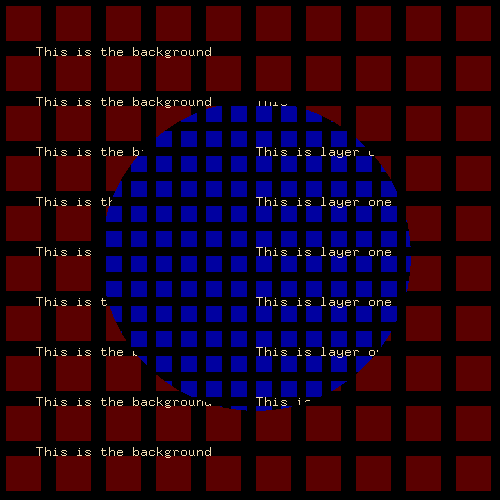
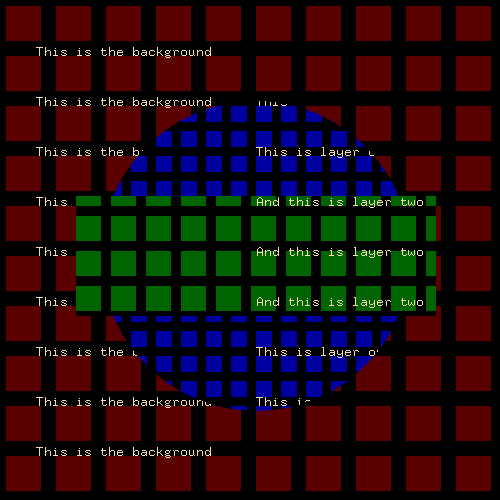
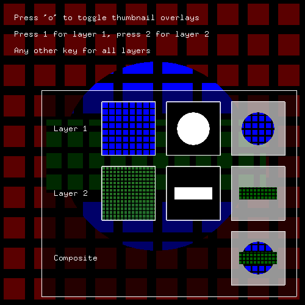

ofxLayerMask
============
This addon makes it easy to draw a graphical layer, and then hide parts of that layer with a mask. It operates on the same principles as [layer masking in Photoshop](http://www.wikihow.com/Add-a-Layer-Mask-in-Photoshop).

Under the hood it uses [frame buffer objects](http://openframeworks.cc/documentation/gl/ofFbo.html) and [shaders](http://openframeworks.cc/tutorials/graphics/shaders.html) - but the addon handles all of that for you and lets you focus on drawing.

How to get started
------------------
If you clone this repo to your addon directory and run the simple example, you will see something like this:



The code follows this simple pattern. Just go ahead and draw whatever you like in the layer and the mask:

```cpp
ofxLayerMask masker;

void ofApp::setup() {
    masker.setup(width, height);
    masker.newLayer();
}

void ofApp::update(){
    //Draw any background here

    masker.beginMask();
    //Draw any mask you like
    masker.endMask();
    
    masker.beginLayer();
    //Draw any layer you like
    masker.endLayer();
}

void ofApp::draw() {
    masker.draw();
}
```

Working with multiple layers
----------------------------
You can add as many layers as you like. If you run the multi example you will see something like this:



The pattern is very similar, with just a couple of differences:

```cpp
ofxLayerMask masker;
int layer1, layer2;

void ofApp::setup() {
    masker.setup(width, height);
    layer1 = masker.newLayer();
    layer2 = masker.newLayer();
}

void ofApp::update(){
    //Draw any background here

    masker.beginMask(layer1);
    //Draw any mask you like
    masker.endMask(layer1);
    
    masker.beginLayer(layer1);
    //Draw any layer you like
    masker.endLayer(layer1);

    masker.beginMask(layer2);
    //Draw any mask you like
    masker.endMask(layer2);
    
    masker.beginLayer(layer2);
    //Draw any layer you like
    masker.endLayer(layer2);
}

void ofApp::draw() {
    masker.draw();
}
```

Using the overlay
-----------------
When you start working with multiple masks and layers it can quickly become confusing without visual feedback. While the examples are running, hit 'o' to get an overlay like this:



To toggle the overlay in your own code, call the `toggleOverlay()` function:

```cpp
void ofApp::keyPressed(int key){
    if(key == 'o') {
        masker.toggleOverlay();
    }
}
```

Dependencies
------------
The addon has no dependencies. Tested against [openFrameworks 0.8.4](http://openframeworks.cc/download/).