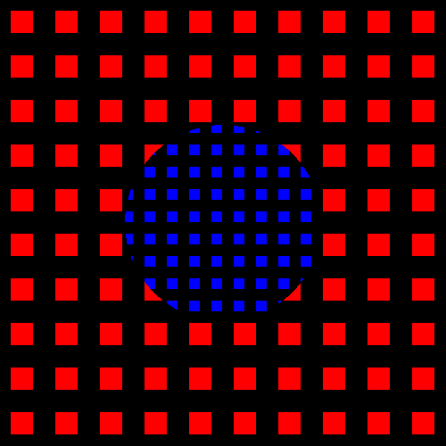

ofxLayerMask
============
Use an alpha mask to reveal a foreground layer against a background. Under the hood it uses frame buffer objects and shaders, but the addon handles all of that for you and lets you focus on drawing.



Clone this addon and run the example, and you will see this animation running.

Usage
-----
You can check out the example code which runs the simple animation above, but the basic pattern is this:

```
ofxLayerMask masker;

void ofApp::setup() {
    masker.setup(width, height);
}

void ofApp::updateAnim(){
    masker.beginBackground();
    //Draw a background
    masker.endBackground();
    
    masker.beginMask();
    //draw a mask
    masker.endMask();
    
    masker.beginForeground();
    //Draw a foreground
    masker.endForeground();
}

void ofApp::draw() {
    masker.draw();
}
```

The addon has no dependencies. Tested against [openFrameworks 0.8.4](http://openframeworks.cc/download/).